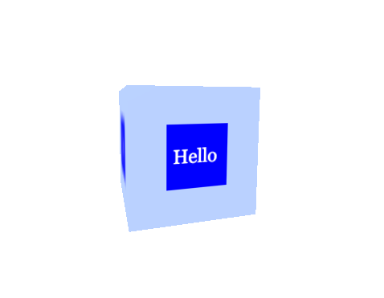

# AFrame Draw Component

HTML5 canvas as a material for an [A-Frame](https://aframe.io) VR entity.



Fully extendable with components which utilize the canvas api.

## Installation

`npm i aframe-draw-component --save`

##Usage

Register the component with AFrame:

```js
var AFRAME = require("aframe-core");
var draw = require("aframe-draw-component").component;
AFRAME.registerComponent("draw", draw);
```

Then, you can implement it with third party components which utilize the draw component. Just put it after the `draw` prop, like this example using a `square` component:

```html
<a-entity position="0 1 0" geometry="primitive: box" draw="width: 256; height: 256" square="text: Hello">
</a-entity>
```

Or, if you want direct access to the Canvas API, write a quick component yourself:

```js
AFRAME.registerComponent("square", {
	dependencies: ["draw"],

	init: function() {
		var draw = this.el.components.draw;
		var ctx = draw.ctx;
		var canvas = draw.canvas;
		ctx.fillStyle = "#AFC5FF";
		ctx.fillRect(0, 0, canvas.width, canvas.height);
		ctx.fillStyle = "blue";
		ctx.fillRect(68, 68, 120, 120);
		ctx.fillStyle = "white";
		ctx.font = "36px Georgia";
		ctx.fillText(this.data.text, 80, 140);
		draw.render();
	}
});
```

The example above is also key to writing your own components which use `draw`. The `draw` component exposes a hidden `canvas` and `ctx` which can be used to perform regular methods on. The material must then be updated, so call the `render()` method.


##Methods & Component Properties

* These are only needed for writing your own components which utilize `draw`.

|Property|Description|
|------|-------|
|`.canvas`|hidden canvas to perform methods on|
|`.ctx`|hidden ctx to perform methods on|
|`.render()`|update the material with the new canvas|

##Properties

|Property|Description|
|------|-------|
|`width`|width of canvas (should match ratio of a face of the entity)|
|`height`|height of canvas (should match ratio of a face of the entity)|

##Featured Components
* none yet!

##Additional Info

* Thanks to [ngokevin](https://github.com/ngokevin) and [RangerMauve](https://github.com/RangerMauve) for their help.
* As this is meant to be an extendable component, PR's to the readme are welcome.